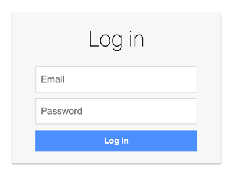

# AO - Firebase

This mock server is designed to provide the ability to test a case [Firebase](https://firebase.google.com/) applications

## Usage

Start the following mock server as follows:

```bash
$ docker run -p 8080:8080 -e HTTP_PORT=8080 ghcr.io/neuralegion/ao-firebase
```

While having the application running, open a browser and type `http://localhost:8080`, and hit enter.

You should see the "Log-in" form, like in the following screenshot:



To explore the application:

- Type "root@brightsec.com" to the "Email" field
- Type "root@brightsec.com" to the "Password" field
- Click on the "Log in" button
- Wait for the "Dashboard" page

You can also use the following recording in JSON: [recording.json](assets/recording.json)

This will perform OAuth2 flow, retrieving access, id, and refresh tokens that will be stored in Indexed DB for further usage. In case of successful authorization, you will be redirected to `http://localhost:8080/`. Finally, the application will send a request to obtain additional information about your membership to the server using the id token previously obtained to `GET /api/userinfo`
