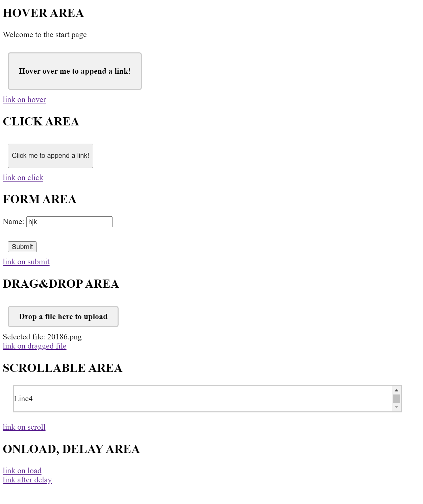

# Dynamic links server

This mock server is designed to test crawling on a target with links, which appear on the 'load' event, after a small delay and on different user interactions.

The following logics is implemented:

- link appears on `load` event;
- link appears after a 2 sec delay;
- link appears after hovering over an element (`mouseover` event);
- link appears after a click on an element;
- link appears on `submit` event;
- link appears on `drop` event on drag-n-drop form;
- link appears on `scroll` event in a scrollable element.

This is how the main page looks like when all the links are displayed:


## Usage

Start the mock server as follows:

```bash
$ docker run -p 8080:8080 -e HTTP_PORT=8080 ghcr.io/neuralegion/dynamic-link-server
```

## Related bugs

https://team-1602965683919.atlassian.net/jira/software/c/projects/NLJ/issues/NLJ-1657
